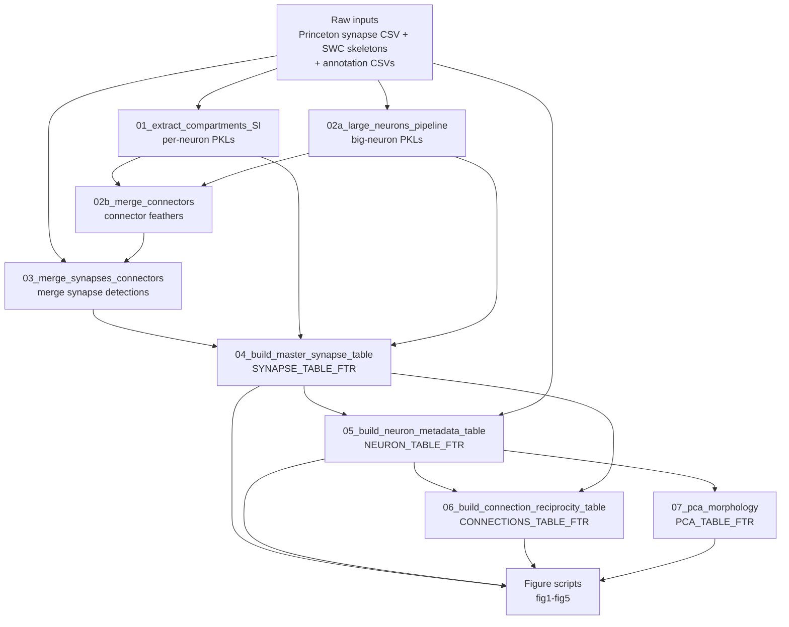

# Pipeline Overview

This document describes the processing pipeline that converts raw connectome inputs into the
derived tables used by the figure scripts.

**Run order:** 01 → 02a → 02b → 03 → 04 → 05 → 06 → 07  
**All paths are defined in:** `config.py`  
**All scripts import:** `methods/methods_all.py` via `METHODS_DIR`

---

## Pipeline flow

See `docs/diagrams/` for rendered versions of this diagram.

---

## Script 01 — Extract Compartments + SI (standard neurons)

**File:** `processing/01_extract_compartments_SI.py`

Walks each neuron's SWC skeleton to classify synapses as axonal or dendritic, and computes the
Synaptic Input Index (SI) for every standard neuron. Saves one pickle file per neuron.

| | |
|--|--|
| **Inputs** | `PRINCETON_SYNAPSE_CSV`, `SWC_DIR` |
| **Outputs** | Per-neuron PKL files in `PROCESSED_SWC_DIR` (`data/intermediate/processed_swc_data/`) |
| **Runtime** | Several hours (parallelisable per neuron) |
| **Downstream** | Scripts 02b, 04 |

---

## Script 02a — Large Neurons Pipeline

**File:** `processing/02a_large_neurons_pipeline.py`

Applies the same compartment-labelling and SI logic as script 01, but for oversized neurons that
require a separate memory/chunking strategy. Also writes big-neuron connector feather tables directly.

| | |
|--|--|
| **Inputs** | `PRINCETON_SYNAPSE_CSV`, `SWC_DIR` |
| **Outputs** | PKL files in `PROCESSED_BIG_NEURONS_DIR`; `PRE_CONNECTORS_BIGN_FTR`, `POST_CONNECTORS_BIGN_FTR` |
| **Downstream** | Scripts 02b, 03, 04 |

---

## Script 02b — Merge Connectors

**File:** `processing/02b_merge_connectors.py`

Reads per-neuron PKL files from script 01 and aggregates them into combined pre- and post-synaptic
connector feather tables for standard neurons.

| | |
|--|--|
| **Inputs** | `PROCESSED_SWC_DIR` (per-neuron PKL files from script 01) |
| **Outputs** | `PRE_CONNECTORS_FTR`, `POST_CONNECTORS_FTR` (in `data/intermediate/connectors/`) |
| **Downstream** | Script 03 |

---

## Script 03 — Merge Synapses and Connectors

**File:** `processing/03_merge_synapses_connectors.py`

Joins the raw Princeton synapse detection table with the per-neuron connector tables (both standard
and large-neuron batches) to produce a unified synapse table with connector associations.

| | |
|--|--|
| **Inputs** | `PRINCETON_SYNAPSE_CSV`, `PRE_CONNECTORS_FTR`, `POST_CONNECTORS_FTR`, `PRE_CONNECTORS_BIGN_FTR`, `POST_CONNECTORS_BIGN_FTR` |
| **Outputs** | `SYNAPSES_PRE_MERGE_FTR`, `SYNAPSE_NON_PROCESSED_FTR` |
| **Downstream** | Script 04 |

---

## Script 04 — Build Master Synapse Table

**File:** `processing/04_build_master_synapse_table.py`

Assigns final compartment labels (AA/AD/DA/DD) to every synapse in the merged table. This produces
the primary analysis-ready synapse table used by nearly all figure scripts.

| | |
|--|--|
| **Inputs** | `SYNAPSE_NON_PROCESSED_FTR`, per-neuron PKL files from `PROCESSED_SWC_DIR` and `PROCESSED_BIG_NEURONS_DIR` |
| **Outputs** | `SYNAPSE_TABLE_FTR` (`synapses_783_article_princeton.ftr`) |
| **Key columns added** | `comp` (AA/AD/DA/DD), `SI_pre`, `SI_post` |
| **Downstream** | Scripts 05, 06; most figure scripts |

---

## Script 05 — Build Neuron Metadata Table

**File:** `processing/05_build_neuron_metadata_table.py`

Aggregates per-synapse information to the per-neuron level and joins annotation tables to create
the main neuron metadata table used by almost all figure scripts.

| | |
|--|--|
| **Inputs** | `NEURON_ANNOTATIONS_CSV`, `CELL_STATS_CSV`, `NEURONS_CSV`, `SYNAPSE_TABLE_FTR`, per-neuron PKLs, `RANKS_DIR` |
| **Outputs** | `SWC_DATA_FTR`, `NEURON_TABLE_FTR` (`neuron_data_full_article_princeton.ftr`) |
| **Key columns** | `root_id`, `super_class`, `primary_type`, `nt_type`, `SI`, `cable_length`, synapse counts, morphological features, sensory rank columns |
| **Downstream** | Scripts 06, 07; virtually all figure scripts |

---

## Script 06 — Build Connection and Reciprocity Table

**File:** `processing/06_build_connection_reciprocity_table.py`

Takes the synapse table and neuron table, computes per-connection synapse-type counts, identifies
reciprocal pairs, and produces the connection-level analysis table.

| | |
|--|--|
| **Inputs** | `NEURON_TABLE_FTR`, `SYNAPSE_TABLE_FTR` |
| **Outputs** | `CONNECTIONS_TABLE_FTR` (`connections_by_syn_type_reciprocal_types_filtered_article_princeton.ftr`); several intermediate filtered variants |
| **Key columns** | `pre`, `post`, `AA`, `AD`, `DA`, `DD` (synapse counts), `sum_syn`, `reciprocal` (bool), `same_type` (bool) |
| **Downstream** | Figures 3, 4, 5 |

---

## Script 07 — PCA of Morphological Features

**File:** `processing/07_pca_morphology.py`

Runs PCA on per-neuron morphological feature vectors from the neuron metadata table. Produces
per-neuron PCA scores used in Figure 4.

| | |
|--|--|
| **Inputs** | `NEURON_TABLE_FTR` |
| **Outputs** | `PCA_TABLE_FTR` (`neurons_pca_princeton.ftr`) |
| **Key columns** | `neuron`, `PC1`, `PC2` |
| **Downstream** | `figures/fig4/syntype_x_pc1.py` |

---

## Figure script dependencies

This table shows which derived tables each figure folder uses. All figure scripts also import
`config.py` and `methods/methods_all.py`.

| Table | Fig 1 | Fig 2 | Fig 3 | Fig 4 | Fig 5 |
|-------|-------|-------|-------|-------|-------|
| `SYNAPSE_TABLE_FTR` | x | x | x | x | |
| `SYNAPSE_TABLE_RAW_FTR` | x | | | | |
| `NEURON_TABLE_FTR` | x | x | x | x | x |
| `NEURON_TABLE_NONP_FTR` | | x | x | | x |
| `SYNAPSE_TABLE_NONP_FTR` | | x | x | | |
| `CONNECTIONS_TABLE_FTR` | | | x | x | x |
| `FULL_RECI_CONNECTIONS_FTR` | | | | | x |
| `CONNECTIONS_TABLE_NONP_FTR` | | | | | x |
| `RECI_PROP_FTR` | | | | | x |
| `PCA_TABLE_FTR` | | | | x | |
| `PCA_TABLE_NONP_FTR` | | | | x | |
| `PC1_TABLE_CSV` | | | | x | |
| `NEURON_ANNOTATIONS_CSV` (raw) | | x | x | | |
| `CLASSIFICATION_CSV` (raw) | | | x | | |
| `NEUROPIL_SYNAPSE_CSV` (raw) | | x | | | |
| `LARVA_SYNAPSES_FTR` / `LARVA_SI_FTR` | | x | | | |
| `NEURONS_NT_BWF_FTR` | | | | | x |

Note: `NEURON_TABLE_NONP_FTR`, `SYNAPSE_TABLE_NONP_FTR`, `CONNECTIONS_TABLE_NONP_FTR`, and
`PCA_TABLE_NONP_FTR` are non-Princeton-synapse-table variants used for methodological comparisons
within specific figure panels. They are generated by running the pipeline with a different input
synapse table.
