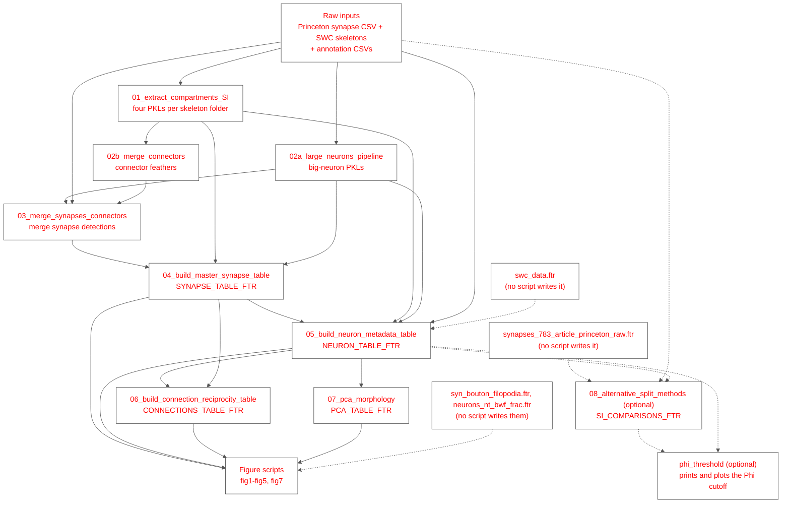

# Pipeline Overview

This document describes the processing pipeline that converts raw connectome inputs into the
derived tables used by the figure scripts.

**Run order:** 01 → 02a → 02b → 03 → 04 → 05 → 06 → 07 (08 is optional: the split-method comparison; `phi_threshold.py` is optional and runs after 08). The larval step, `processing/larva/larva_process.py`, is separate and is needed only for Figure 2A.  
**All paths are defined in:** `config.py`  
**The numbered scripts import:** `methods/methods_all.py` via `METHODS_DIR`

---

## Pipeline flow

```mermaid
%%{init: {'theme': 'base', 'themeVariables': {'primaryColor': '#ffffff', 'primaryTextColor': '#ff0000', 'primaryBorderColor': '#555555', 'lineColor': '#555555'}}}%%
flowchart TD
    RAW["Raw inputs\nPrinceton synapse CSV + SWC skeletons\n+ annotation CSVs"]
    S01["01_extract_compartments_SI\nfour PKLs per skeleton folder"]
    S02A["02a_large_neurons_pipeline\nbig-neuron PKLs"]
    S02B["02b_merge_connectors\nconnector feathers"]
    S03["03_merge_synapses_connectors\nmerge synapse detections"]
    S04["04_build_master_synapse_table\nSYNAPSE_TABLE_FTR"]
    S05["05_build_neuron_metadata_table\nNEURON_TABLE_FTR"]
    S06["06_build_connection_reciprocity_table\nCONNECTIONS_TABLE_FTR"]
    S07["07_pca_morphology\nPCA_TABLE_FTR"]
    S08["08_alternative_split_methods (optional)\nSI_COMPARISONS_FTR"]
    FIGS["Figure scripts\nfig1-fig5, fig7"]

    RAW --> S01
    RAW --> S02A
    S01 --> S02B
    S02A --> S03
    RAW --> S03
    S02B --> S03
    S03 --> S04
    S01 --> S04
    S02A --> S04
    S04 --> S05
    S01 --> S05
    S02A --> S05
    RAW --> S05
    S05 --> S06
    S04 --> S06
    S05 --> S07
    S04 --> FIGS
    S05 --> FIGS
    S06 --> FIGS
    S07 --> FIGS
    SYNRAW["synapses_783_article_princeton_raw.ftr\n(no script writes it)"] -.-> S08
    SWCDATA["swc_data.ftr\n(no script writes it)"] -.-> S05
    FILO["syn_bouton_filopodia.ftr, neurons_nt_bwf_frac.ftr\n(no script writes them)"] -.-> FIGS
    RAW -.-> S08
    S05 -.-> S08
    S08 -.-> PHI["phi_threshold (optional)\nprints and plots the Phi cutoff"]
    S05 -.-> PHI
```

---

## Script 01 — Extract Compartments + SI (standard neurons)

**File:** `processing/01_extract_compartments_SI.py`

Walks each neuron's SWC skeleton to classify synapses as axonal or dendritic, and computes the
Synaptic Input Index (SI) for every standard neuron. Works through the skeleton subfolders of `SWC_DIR` one at a time and saves four pickles per subfolder (`connectors.pkl`, `all_SI.pkl`, `issues.pkl`, `linker.pkl`), each covering every neuron in it. Synapses from a neuron to itself are dropped first, and synapses more than 10,000 nm from the nearest skeleton node are dropped when they are attached, so SI is computed on the axon and dendrite synapses that are left (linker synapses are not counted).

| | |
|--|--|
| **Inputs** | `PRINCETON_SYNAPSE_CSV`, `SWC_DIR` |
| **Outputs** | Four PKL files per skeleton subfolder in `PROCESSED_SWC_DIR` (`data/intermediate/processed_swc_data/`) |
| **Runtime** | Several hours (a serial loop over the skeleton subfolders) |
| **Downstream** | Scripts 02b, 04, 05 |

---

## Script 02a — Large Neurons Pipeline

**File:** `processing/02a_large_neurons_pipeline.py`

Applies the same compartment-labelling and SI logic as script 01, but for oversized neurons that
require a separate memory/chunking strategy. Also writes big-neuron connector feather tables directly.

| | |
|--|--|
| **Inputs** | `PRINCETON_SYNAPSE_CSV`, `SWC_DIR` |
| **Outputs** | PKL files in `PROCESSED_BIG_NEURONS_DIR`; `PRE_CONNECTORS_BIGN_FTR`, `POST_CONNECTORS_BIGN_FTR` |
| **Downstream** | Scripts 03, 04, 05 |

---

## Script 02b — Merge Connectors

**File:** `processing/02b_merge_connectors.py`

Reads the `connectors.pkl` file of each script 01 output folder and aggregates them into combined
pre- and post-synaptic connector feather tables for standard neurons. It takes nothing from 02a.

| | |
|--|--|
| **Inputs** | `PROCESSED_SWC_DIR` (the `connectors.pkl` files from script 01) |
| **Outputs** | `PRE_CONNECTORS_FTR`, `POST_CONNECTORS_FTR` (in `data/intermediate/connectors/`) |
| **Downstream** | Script 03 |

---

## Script 03 — Merge Synapses and Connectors

**File:** `processing/03_merge_synapses_connectors.py`

Joins the raw Princeton synapse detection table with the per-neuron connector tables (both standard
and large-neuron batches) to produce a unified synapse table with connector associations.

| | |
|--|--|
| **Inputs** | `PRINCETON_SYNAPSE_CSV`, `PRE_CONNECTORS_FTR`, `POST_CONNECTORS_FTR`, `PRE_CONNECTORS_BIGN_FTR`, `POST_CONNECTORS_BIGN_FTR` |
| **Outputs** | `SYNAPSES_PRE_MERGE_FTR`, `SYNAPSE_NON_PROCESSED_FTR` |
| **Downstream** | Script 04 |

---

## Script 04 — Build Master Synapse Table

**File:** `processing/04_build_master_synapse_table.py`

Assigns final compartment labels (AA/AD/DA/DD, or one of five linker combinations such as AL) to every synapse in the merged table. This produces
the primary analysis-ready synapse table used by nearly all figure scripts.

| | |
|--|--|
| **Inputs** | `SYNAPSE_NON_PROCESSED_FTR`, the SI PKL files from `PROCESSED_SWC_DIR` (per folder) and `PROCESSED_BIG_NEURONS_DIR` (per neuron) |
| **Outputs** | `SYNAPSE_TABLE_FTR` (`synapses_783_article_princeton.ftr`) |
| **Key columns added** | `comp` (nine possible values; filter to AA/AD/DA/DD), `SI_pre`, `SI_post` |
| **Downstream** | Scripts 05, 06; most figure scripts |

---

## Script 05 — Build Neuron Metadata Table

**File:** `processing/05_build_neuron_metadata_table.py`

Aggregates per-synapse information to the per-neuron level and joins annotation tables to create
the main neuron metadata table used by almost all figure scripts.

| | |
|--|--|
| **Inputs** | `NEURON_ANNOTATIONS_CSV`, `CELL_STATS_CSV`, `NEURONS_CSV`, `SYNAPSE_TABLE_FTR`, the SI and linker PKLs from `PROCESSED_SWC_DIR` (per folder) and `PROCESSED_BIG_NEURONS_DIR` (per neuron), `RANKS_DIR`, `SWC_DATA_FTR` (not generated by any script; see `docs/data_availability.md`) |
| **Outputs** | `SI_UPDATED_FTR`, `NEURON_TABLE_FTR` (`neuron_data_full_article_princeton.ftr`) |
| **Key columns** | `root_id`, `super_class`, `primary_type`, `nt_type`, `SI`, `cable_length`, synapse counts, morphological features, sensory rank columns |
| **Downstream** | Scripts 06, 07, 08, `phi_threshold.py`; virtually all figure scripts |

---

## Script 06 — Build Connection and Reciprocity Table

**File:** `processing/06_build_connection_reciprocity_table.py`

Takes the synapse table and neuron table, computes per-connection synapse-type counts, identifies
reciprocal pairs, and produces the connection-level analysis table.

| | |
|--|--|
| **Inputs** | `NEURON_TABLE_FTR`, `SYNAPSE_TABLE_FTR` |
| **Outputs** | `CONNECTIONS_TABLE_FTR` (`connections_by_syn_type_reciprocal_types_filtered_article_princeton.ftr`), `FULL_RECI_CONNECTIONS_FTR` (reciprocal pairs, read by four Fig 5 scripts), `RECIPROCITY_LIST_FTR`, and two intermediate tables, `CONNECTIONS_FILTERED_FTR` and `CONNECTIONS_RECI_FILTERED_FTR` |
| **Key columns** | `pre`, `post`, `AA`, `AD`, `DA`, `DD` (synapse counts), `sum_syn`, `reciprocal` (int 0/1), `primary_type_x`, `primary_type_y`, `same_type` (int 0/1) |
| **Downstream** | Figures 3, 4, 5 |

---

## Script 07 — PCA of Morphological Features

**File:** `processing/07_pca_morphology.py`

Runs PCA on per-neuron morphological feature vectors from the neuron metadata table. Produces
per-neuron PCA scores used in Figure 4.

| | |
|--|--|
| **Inputs** | `NEURON_TABLE_FTR` |
| **Outputs** | `PCA_TABLE_FTR` (`neurons_pca_princeton.ftr`) |
| **Key columns** | `neuron`, `PC1`, `PC2` |
| **Downstream** | `figures/fig4/build_pc1_table.py`, `figures/fig4/syntype_x_pc1.py` |

---

## Larval step (for Figure 2A)

**File:** `processing/larva/larva_process.py`

Attaches the larval synapses to the larval skeletons, splits each neuron into axon and dendrite and
computes SI, for the larval curve in Figure 2A. Independent of scripts 01–08.

| | |
|--|--|
| **Inputs** | `LARVA_SWC_DIR`, `LARVA_SYNAPSE_TABLE_CSV`, `LARVA_NEURON_LIST_CSV` (the larval raw files, from the corresponding author) |
| **Outputs** | `LARVA_SI_FTR`, `LARVA_SYNAPSES_FTR`, and intermediate connector tables in `LARVA_DATA_DIR` |
| **Downstream** | `figures/fig2/fig2a_si_cdf_adult_larva.py` |
| **Note** | As committed it produces no usable output: it calls `attach_synapses_larva2` (line 101), which is not defined in this repository; the bare `except` in `heal_attach`, which is called once on the whole neuron list (line 147), turns that error into a text string, so no neuron is split and the SI output is empty |

---

## Script 08 — Alternative Split Methods (optional)

**File:** `processing/08_alternative_split_methods.py`

Compares the published SFC axon/dendrite split with two single-node cuts: the node whose cut
gives the highest SI (MaxSI), and the node with the lowest Fisher p-value (MinFisherP). A
candidate node is any non-root node with exactly one child; the synapses on that node are left
out of its score. Runs over the intrinsic neurons in batches of 500 and skips batches whose
output files already exist. An existing `SI_comparisons.ftr` is never overwritten. `MaxSI_SI` can be lower than
`SFC_SI` (2,433 of 118,347 neurons in the authors' `SI_comparisons.ftr`): the SFC score leaves linker synapses out, while a
single cut places every synapse except those on the cut node on one side, and only nodes with one child can be cut.

| | |
|--|--|
| **Inputs** | `NEURON_TABLE_FTR`, `SYNAPSE_TABLE_RAW_FTR`, skeletons in `SWC_DIR` |
| **Outputs** | Per batch in `ALT_SPLIT_BATCH_DIR`: `summary_batch_NNNN.ftr`, `nodes_batch_NNNN.ftr`, `failures_batch_NNNN.ftr`; combined `SI_COMPARISONS_FTR` (`SI_comparisons.ftr`), written only if that file does not already exist |
| **Key columns** | `neuron_id`, `SFC_SI`, `SFC_Phi`, `MaxSI_SI`, `MinFisherP_Phi` |
| **Downstream** | `processing/phi_threshold.py` |
| **Note** | No script in this repository writes `SYNAPSE_TABLE_RAW_FTR`, and `SWC_DIR` must hold the skeletons of every intrinsic neuron, so the script cannot be run from the downloads alone. Unlike scripts 01 and 02a, it does not drop synapses from a neuron to itself, so its `SFC_SI` matches the SI of script 05 only if that table has none. When combining, a missing batch file is printed and skipped, so check that the combined table has one row per intrinsic neuron |

---

## Phi threshold (optional)

**File:** `processing/phi_threshold.py`

Finds the Phi value that matches the SI = 0.1 cutoff, so that split methods scored with Phi
can use a matching cutoff. It uses the SFC split, where `SI_comparisons.ftr` gives each neuron
both an SI and a Phi, and keeps only the intrinsic neurons (the four super-classes the figures
use). It finds the cutoff in three ways: the typical Phi of neurons with SI within 0.005 of 0.1,
the Phi value that calls the same share of neurons mixed, and the Phi cutoff that agrees with
SI < 0.1 for the most neurons. The recommended cutoff is the median of the three, rounded to two
decimals, and is reported with the range of the three. The script also prints the share of
neurons each method calls mixed, checks the match within super-classes and by input/output
balance and synapse count, and gives 95% intervals by resampling whole cell types. Phi does not
follow SI exactly, so the match holds on average, not for every neuron.

| | |
|--|--|
| **Inputs** | `SI_COMPARISONS_FTR`, `SI_UPDATED_FTR` (the script stops unless `SFC_SI` equals it, so the cutoff matches the SI in this file), `NEURON_TABLE_FTR` (super_class, primary_type, and axon/dendrite input and output counts for grouping) |
| **Outputs** | Printed results, and `outputs/phi_threshold/phi_threshold.svg` (the typical Phi at each SI, and the Phi of the neurons at SI = 0.1, with the three estimates) |
| **Downstream** | None in this repository |

---
